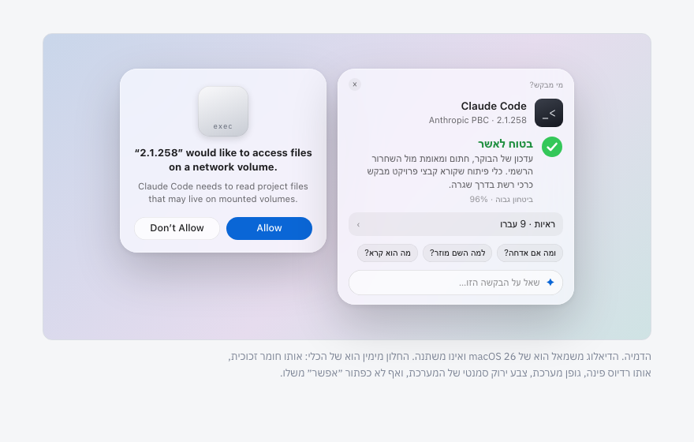

# whoRU

> Know who is really asking before you click **Allow**.

Every few days macOS shows a dialog like *“2.1.258” would like to access files on a network volume.* The name in the dialog is often meaningless, and the dialog gives you no way to find out who is asking, why, or whether it is safe. So people click Allow out of habit, or Don’t Allow out of fear.

whoRU is a small menu-bar app for macOS. When a permission dialog appears, whoRU shows up next to it and answers three questions in a few seconds:

1. **Who is this, really?** It finds the actual program behind the name, shows its real icon and publisher, and verifies the code signature.
2. **Is it what it claims to be?** It compares the file’s hash against the publisher’s official release, checks where it was downloaded from, where it lives on disk, and who launched it.
3. **Does the request make sense?** Optionally, an AI model reads the evidence and explains it in plain language: what the program is, why it probably needs this permission, and what breaks if you say no. You can keep asking questions.

whoRU never clicks anything for you. The Allow and Don’t Allow buttons stay yours.



## Status

Early development. The project is being built in the open, commit by commit, from the [design document](docs/DESIGN.md).

- [ ] Core models, dialog text parser, hard-evidence scoring
- [ ] macOS evidence checks (signature, notarization, hash, provenance, location, process chain, persistence)
- [ ] Requester resolver (dialog name → file on disk)
- [ ] Command-line scanner
- [ ] Dialog watcher (Accessibility)
- [ ] Companion panel next to the dialog
- [ ] AI analyst (Claude API, Claude Code) with a strict evidence contract
- [ ] Onboarding, settings, history
- [ ] Signed, notarized builds

## How it works

```
permission dialog ──▶ Watcher ──▶ Resolver ──▶ Collector ──▶ HardScore ──▶ (AI Analyst) ──▶ Companion panel
                                                                                          └──▶ History
```

- **Watcher** notices a new permission dialog through the Accessibility API and reads its text and position.
- **Resolver** turns the display name in the dialog into a file on disk, a process, and a bundle identifier, with a confidence level.
- **Collector** runs independent evidence checks in parallel. Each one is a deterministic command or system API whose raw output you can inspect.
- **HardScore** turns the evidence into a red / amber / green floor and ceiling. A broken signature is red, no matter what anyone says afterwards.
- **AI Analyst** (optional) receives the evidence bundle and returns a structured verdict. It can lower confidence and raise suspicion. It cannot turn a red into a green; the app enforces that in code, not in the prompt.

## Principles

- **Evidence before opinions.** Every line is marked as either evidence (from a deterministic check) or inference (from the model). The two never mix visually.
- **The model is bound by the evidence.** Hard evidence sets the floor and the ceiling.
- **Never clicks on your behalf.** Not even as an option.
- **Private by default.** Names, paths (with your username removed), signatures, hashes and metadata may leave the machine. File contents never do. That is a hard limit, not a setting.
- **Works without AI.** No network or no API key still gives you the hard evidence and a deterministic verdict.
- **Transparent.** “What was sent?” shows the exact JSON. “How did you check?” shows the commands and their raw output.
- **Built from the system’s own parts.** System materials, system fonts, system symbols, system controls. Nothing to learn.

## Install

Signed builds are not published yet. To build from source you need macOS 26 or later and Xcode 26 or later:

```sh
git clone https://github.com/yairixStudio/whoRU.git
cd whoRU
scripts/build-app.sh          # produces build/whoRU.app
open build/whoRU.app
```

On first launch whoRU asks for the Accessibility permission. It uses it only to read the text of permission dialogs. It never sends keystrokes or clicks.

## Command line

The same evidence pipeline is available without the GUI, which is also how the project is tested:

```sh
swift run whoru-cli scan ~/.local/share/claude/versions/2.1.258 --service networkVolumes
swift run whoru-cli parse '"Google Chrome" would like to access files in your Downloads folder.'
```

## Contributing

whoRU is meant to be easy to contribute to from day one. The best places to start:

- **Dialog text in your language.** The parser learns from real fixtures, not guesses. See [CONTRIBUTING.md](CONTRIBUTING.md#dialog-fixtures).
- **Evidence checks.** Each check is one small file with a clear contract.
- **Publisher list.** Team IDs of well-known publishers, verified from real signatures.
- **A port to another platform.** The core is platform-agnostic Swift; see [docs/PORTING.md](docs/PORTING.md).

Please read [CONTRIBUTING.md](CONTRIBUTING.md) first. It explains what we are looking for, what we will not merge, and how the review works.

## License

[MIT](LICENSE).
