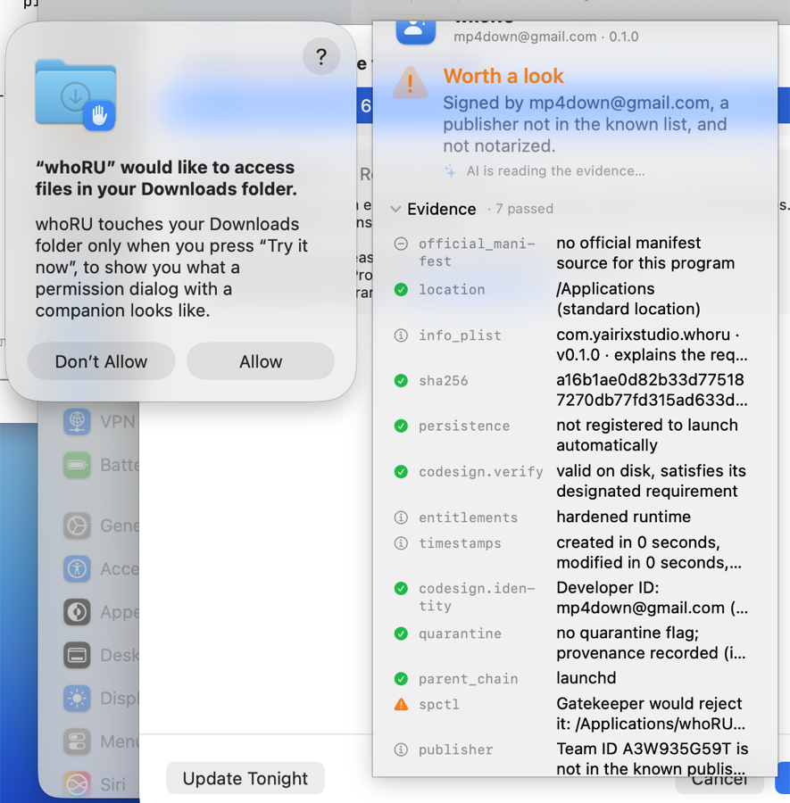
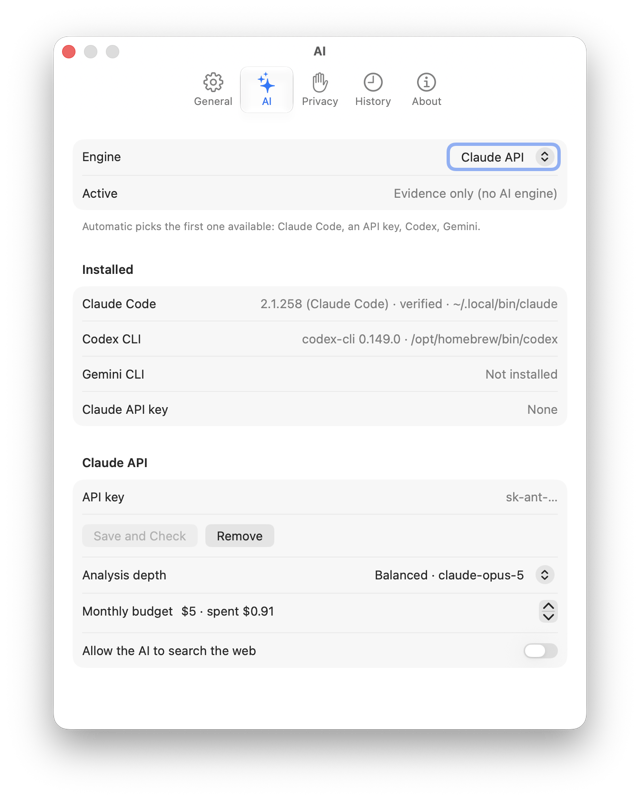

# whoRU

> Know who is really asking before you click **Allow**.

Every few days macOS shows a dialog like *“2.1.258” would like to access files on a network volume.* The name in the dialog is often meaningless, and the dialog gives you no way to find out who is asking, why, or whether it is safe. So people click Allow out of habit, or Don’t Allow out of fear.

whoRU is a small menu-bar app for macOS. When a permission dialog appears, whoRU shows up next to it and answers three questions in a few seconds:

1. **Who is this, really?** It finds the actual program behind the name, shows its real icon and publisher, and verifies the code signature.
2. **Is it what it claims to be?** It compares the file’s hash against the publisher’s official release, checks where it was downloaded from, where it lives on disk, and who launched it.
3. **Does the request make sense?** Optionally, an AI model reads the evidence and explains it in plain language: what the program is, why it probably needs this permission, and what breaks if you say no. You can keep asking questions.

whoRU never clicks anything for you. The Allow and Don’t Allow buttons stay yours.



*A real prompt on macOS, read 22 ms after it appeared. The panel is whoRU's; the dialog is the system's and stays untouched. Design mock: [companion-mock.png](docs/images/companion-mock.png). Checking Chrome: [panel-chrome.png](docs/images/panel-chrome.png).*


## Status

Early, working, unreleased. Built in the open from the [design document](docs/DESIGN.md).

- [x] Core models, dialog text parser with fixtures, hard-evidence scoring, deterministic headline
- [x] macOS evidence checks: signature identity and integrity, Gatekeeper and notarization, SHA-256, official release manifest, download origin, install location, launch chain, persistence, Info.plist declarations, entitlements, timestamps, network connections, optional VirusTotal
- [x] Requester resolver (dialog name → file on disk, with collision handling)
- [x] Command-line scanner (`whoru-cli`)
- [x] AI analysts: Claude API (streaming, structured output, bounded tools), Claude Code headless, local Ollama-style model; verdict validator that enforces the evidence contract in code
- [x] Dialog watcher (window list + Accessibility, independent of which system process draws the dialog) and the companion panel (Liquid Glass, non-activating, follows the dialog)
- [x] Onboarding, settings, history, verdict cache, publisher trust list
- [x] App bundle script, signing, CI
- [x] First live run: a real Downloads-folder prompt on a macOS 27 beta was read in 22 ms and the panel appeared beside it
- [ ] Live validation against every TCC dialog type and more Macs (needs testers: see [issues](https://github.com/yairixStudio/whoRU/issues))
- [ ] Hebrew and other dialog fixtures
- [ ] Developer ID signing, notarization, Sparkle updates, Homebrew cask
- [ ] Full Disk Access path that fills the user’s decision in automatically

What a scan of the Claude Code binary looks like from the terminal today, without AI (0.3 s) and then with the Claude Code engine:

```
  0.00s  subject  2.1.258 · ~/.local/share/claude/versions/2.1.258  [manual_path, high]
  0.11s  ✔ codesign.verify    valid on disk, satisfies its designated requirement
  0.11s  ✔ codesign.identity  Developer ID: Anthropic PBC (Q6L2SF6YDW)
  0.22s  ✔ official_manifest  matches downloads.claude.ai manifest for 2.1.258 (darwin-arm64)
  0.30s  GREEN Safe to allow — Signed by Anthropic PBC and identical to the official release.
  ...
 56.00s  Safe to allow · 90% · allow · fit: matches
        This is the genuine Claude Code tool from Anthropic, and the request fits what it does.
        • The file is byte-for-byte the official Claude Code 2.1.258 release published by Anthropic. [official_manifest]
        • It carries an Apple Developer ID signature issued to Anthropic PBC (team Q6L2SF6YDW). [codesign.identity]
        • It was started from your own terminal session, not by a web browser. [parent_chain]
        ∘ A tool whose job is reading project files plausibly needs a network drive when the project lives on one.
```

## How it works

```
permission dialog ──▶ Watcher ──▶ Resolver ──▶ Collector ──▶ HardScore ──▶ (AI Analyst) ──▶ Companion panel
                                                                                          └──▶ History
```

- **Watcher** notices a new permission dialog through the Accessibility API and reads its text and position.
- **Resolver** turns the display name in the dialog into a file on disk, a process, and a bundle identifier, with a confidence level.
- **Collector** runs independent evidence checks in parallel. Each one is a deterministic command or system API whose raw output you can inspect.
- **HardScore** turns the evidence into a red / amber / green floor and ceiling. A broken signature is red, no matter what anyone says afterwards. A one-sentence headline is on screen in about a second, before any model runs.
- **AI Analyst** (optional) receives the evidence bundle and returns a structured verdict. It can lower confidence and raise suspicion. It cannot turn a red into a green; the app enforces that in code, not in the prompt. Engines: Claude Code, the Claude API, Codex CLI, Gemini CLI, or a local Ollama-style model; whoRU picks whatever is installed and you can change it in Settings → AI.



- **Strictness** (Settings → General): *standard* trusts a valid signature from a known publisher; *strict* insists on notarization or an official-release match and keeps unknown origins amber.

More in [docs/ARCHITECTURE.md](docs/ARCHITECTURE.md).

## Principles

- **Evidence before opinions.** Every line is marked as either evidence (from a deterministic check) or inference (from the model). The two never mix visually.
- **The model is bound by the evidence.** Hard evidence sets the floor and the ceiling.
- **Never clicks on your behalf.** Not even as an option.
- **Private by default.** Names, paths (with your username removed), signatures, hashes and metadata may leave the machine. File contents never do. That is a hard limit, not a setting.
- **Works without AI.** No network or no API key still gives you the hard evidence and a deterministic verdict.
- **Transparent.** “What was sent?” shows the exact JSON. Every evidence row opens the command and its raw output.
- **Built from the system’s own parts.** System materials, system fonts, system symbols, system controls. Nothing to learn.

## Install

Signed builds are not published yet. Building from source takes a minute and needs macOS 26 or later with Xcode 26 or later:

```sh
git clone https://github.com/yairixStudio/whoRU.git
cd whoRU
scripts/build-app.sh          # → build/whoRU.app (signed with your certificate if you have one, else ad-hoc)
open build/whoRU.app
scripts/make-dmg.sh           # → build/whoRU-<version>.dmg, drag-to-Applications
```

First launch walks you through the one permission whoRU needs (Accessibility, used only to read the text of permission dialogs) and the optional AI engine: Claude Code if it is installed and its signature checks out, an API key, or none.

An ad-hoc signed build loses its Accessibility permission when you rebuild; re-grant it in System Settings → Privacy & Security → Accessibility. Developer ID builds will not have this problem.

## Command line

The same pipeline without the GUI, which is also how the project is tested:

```sh
swift build
.build/debug/whoru-cli scan ~/.local/share/claude/versions/2.1.258 --service networkVolumes
.build/debug/whoru-cli scan "/Applications/Google Chrome.app" --service downloadsFolder --no-ai
.build/debug/whoru-cli parse '“Google Chrome” would like to access files in your Downloads folder.'
.build/debug/whoru-cli resolve "2.1.258"
.build/debug/whoru-cli doctor
```

`--json` prints the full scan record; `--no-store` keeps it out of history. The AI engine is picked the same way the app picks it; set `ANTHROPIC_API_KEY` to use the API from the terminal.

## Contributing

whoRU is meant to be easy to contribute to from day one. The best places to start:

- **Dialog text in your language.** The parser learns from real fixtures, not guesses. See [CONTRIBUTING.md](CONTRIBUTING.md#dialog-fixtures). No Swift needed.
- **Testing the watcher.** Grant Accessibility, trigger a dialog (`tccutil reset Camera <bundle id>` then open the app), and report what the panel showed.
- **Evidence checks.** Each check is one small file with a clear contract.
- **Publisher list.** Team IDs of well-known publishers, verified from real signatures.
- **A port to another platform.** The core is platform-agnostic Swift; see [docs/PORTING.md](docs/PORTING.md).

Please read [CONTRIBUTING.md](CONTRIBUTING.md) first. It explains what we are looking for, what we will not merge, and how the review works.

## License

[MIT](LICENSE).

Made by [Yairix Studio](https://github.com/yairixStudio).
